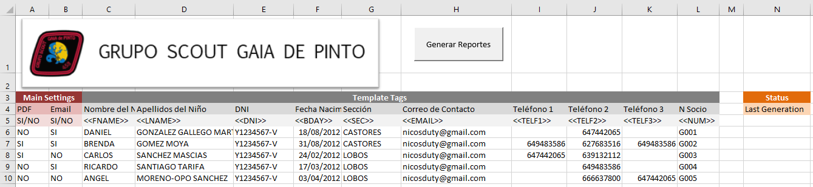

# ScoutsPinto
The following VBA code generates a Word and a PDF form given an excel spreadsheet with multiple entries. There is an option to send this form by email to any recipient.

By clicking on "Generar Reportes" the code loops each entry opening the template file and filling it out with its corresponding tag info. There is no entry or tag limit. However, there should always be an empty column between the last tag and the "Last Generation" column.

Columns A and B (PDF and Email) should always have either "SI" or "NO". Likewise, these two first columns cannot be deleted. 

